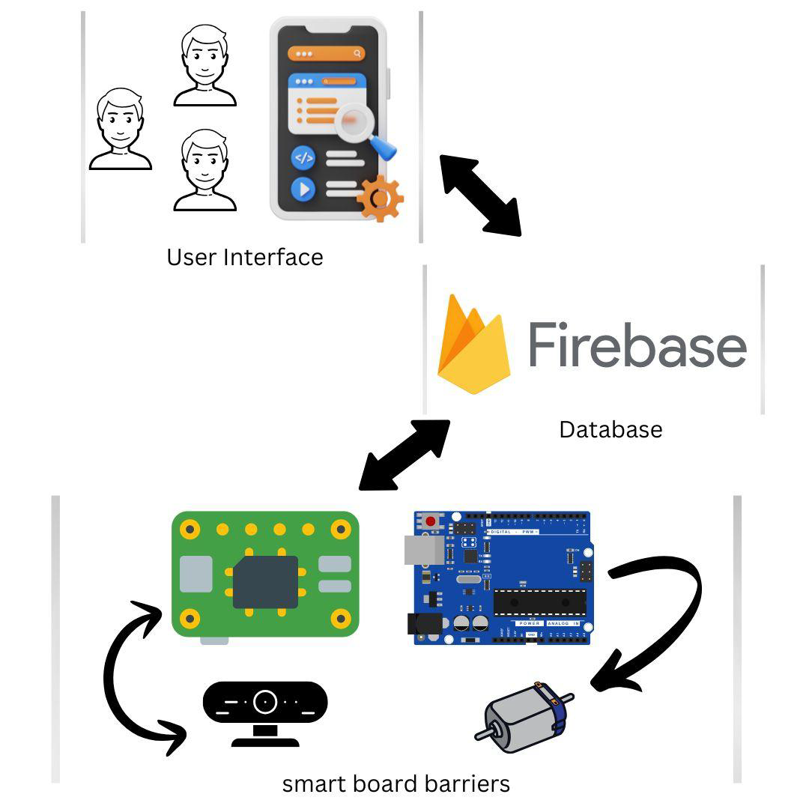
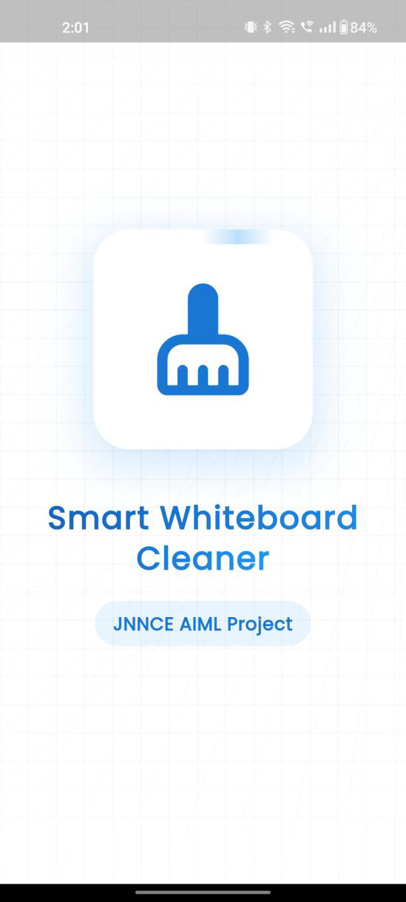
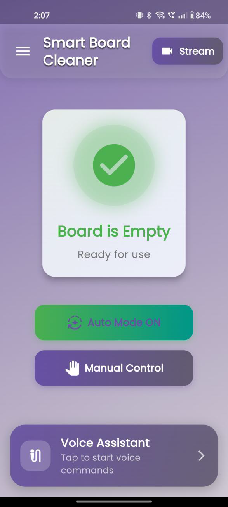
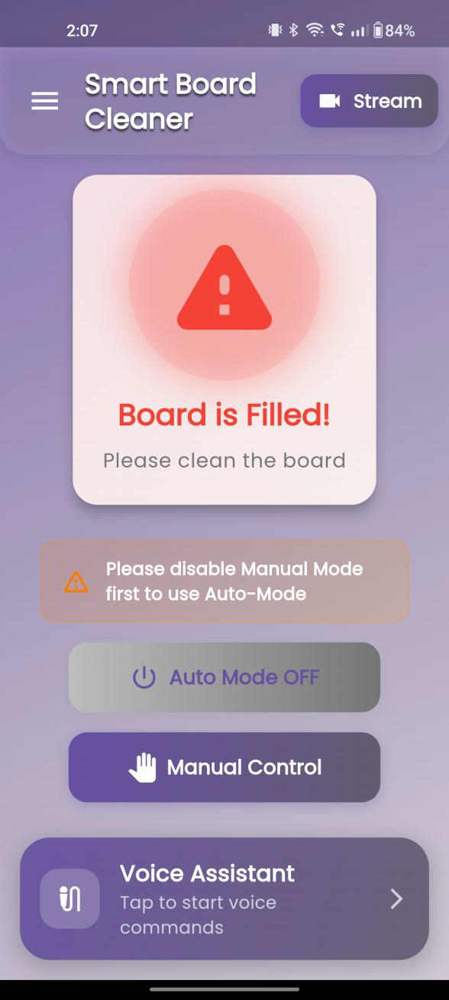
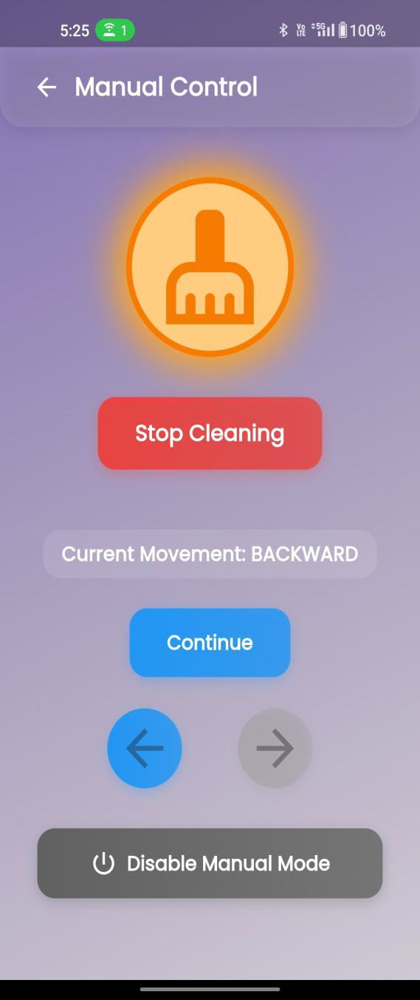
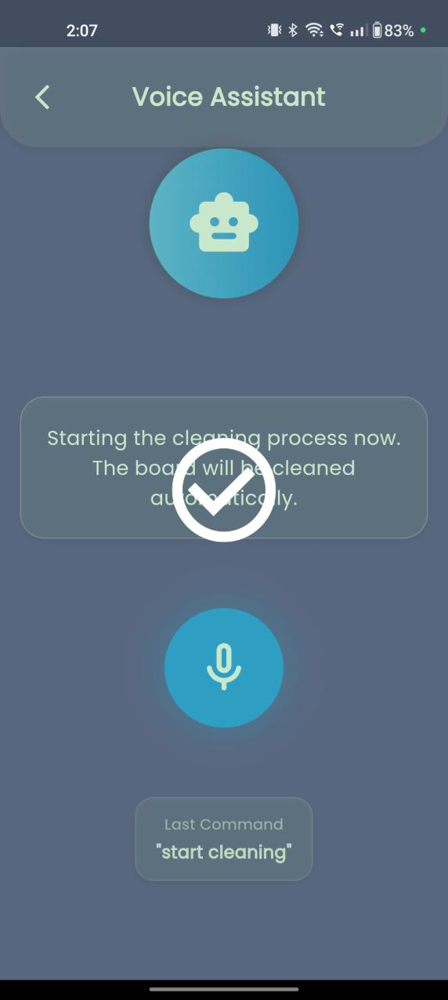

# 🧠 Smart AI Whiteboard Cleaning System

  

An innovative automation solution that combines <b>Artificial Intelligence</b>, <b>IoT</b>, and <b>mobile technology</b> to deliver an efficient and touch-free whiteboard cleaning experience.

---

# 📖 Project Introduction

The **Smart AI Whiteboard Cleaning System** is an intelligent automated mechanism developed to simplify classroom and office board maintenance.

Using **computer vision**, **real-time cloud synchronization**, and **motorized hardware control**, the system detects board usage levels and automatically performs cleaning operations with optimized movement patterns.

The project also includes a **Flutter-based mobile application** for monitoring, manual operation, and live system interaction.

---

# 🌟 Key Highlights

✔️ Intelligent AI-driven cleaning mechanism
✔️ Mobile application for remote access and control
✔️ Voice-enabled command execution
✔️ Real-time live camera streaming
✔️ Firebase cloud synchronization
✔️ Automatic & manual operating modes
✔️ Optimized movement path for efficient cleaning

---

# 🏛️ Overall Architecture

  

---

# 🛠️ Technologies Utilized

| Component         | Tools & Technologies      |
| ----------------- | ------------------------- |
| Mobile Interface  | Flutter                   |
| Cloud Database    | Firebase Firestore        |
| AI Processing     | Python + OpenCV           |
| Embedded Hardware | Arduino Uno, Raspberry Pi |
| Video Streaming   | Flask Server              |

---

# 🔁 Operational Workflow

### Step-by-Step Process

1️⃣ Camera captures the whiteboard image
2️⃣ AI algorithm calculates board occupancy percentage
3️⃣ Status information syncs with Firebase
4️⃣ Microcontroller receives cleaning instruction
5️⃣ Motorized cleaner initiates board wiping
6️⃣ User tracks operations through the Flutter application

---

# 📲 Application Preview

## 🚀 Startup Screen

  

---

## 🔑 Authentication Interface

  

---

## 🖥️ Dashboard – Board Monitoring

  
  

---

## 🎮 Manual Movement Controller

  
  

---

## 🗣️ Voice Interaction Module

  

---

## 📹 Live Camera Feed

  

---

# 🧪 Cleaning Performance

### Before Cleaning vs After Cleaning

  
  

---

# 🔩 Hardware Components

* 🔹 Arduino Uno
* 🔹 Raspberry Pi 4
* 🔹 MG996R Servo Motor
* 🔹 USB Webcam
* 🔹 Rack & Pinion Motion System

---

# 📈 Achievements & Benefits

✅ Reduced board cleaning duration
✅ Minimized human intervention
✅ Improved cleaning consistency
✅ Enabled smart monitoring capabilities
✅ Enhanced classroom automation

---

# 🚀 Future Enhancements

* 🧠 Fully autonomous AI-triggered operation
* 🏫 Integration with smart classroom ecosystems
* 🔋 Backup power support for uninterrupted usage
* 🎯 Advanced stain and marker detection algorithms
* 📊 Analytics dashboard for usage insights

---

# 💡 Project Vision

To create a smarter and more automated educational environment by integrating AI and IoT technologies into everyday classroom operations.
